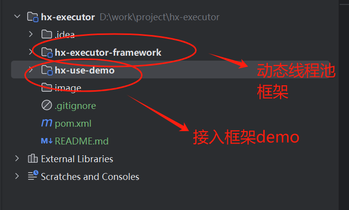

# 动态监控线程池实现框架介绍

## 使用场景介绍

我们在项目代码中，经常使用线程池来异步处理一些线程任务。但是经常会出现以下问题

（1）线程池参数设置不当。一方面，很多历史代码不注意线程池的参数设置，另一方面有些任务也
难以设置合适的线程池参数（只有IO密集，计算密集的理论建议，实际情况很难运用）。而参数
设置不当会导致很多系统上的问题。

（2）难以获知线程池任务的运行情况。一方面，大部分的接口只监控同步逻辑的运行性能，而异步执行
线程池中的性能监控被忽视了，另一方面，异步线程任务异常经常丢失。

使用该线程池框架，可以给系统提供以下功能

（1）实时动态修改线程池关键参数。

（2）实时上报线程池运行状态。

（3）实时监控线程池任务的运行时间以及异常。

## 项目架构解读

## 核心源码思路

### 关键类----org.example.framework.thread.HxExecutor（线程池核心类）

（1）继承ThreadPoolExecutor类，实现线程池的所有功能

（2）实现beforeExecute,afterExecute方法实现任务耗时统计以及统一异常处理

### 关键类----org.example.framework.monitor.MonitorExecutor（监控线程类）

（1）定时扫描所有HxExecutor的bean，上报状态数据

## 关键难点以及思路

（1）如何实现动态修改线程池参数？

我们主要会更改以下三个核心线程池参数--核心线程数、最大线程数、队列长度。ThreadPoolExecutor已经提供修改核心线程数以及最大线程数
的方法，但不支持修改队列长度的方法。观察LinkedBlockingQueue源码，发现队列容量capacity是final修饰，后续自定义一个ResizeableCapacityLinkedBlockingQueue
只要是使用该队列，即可实现修改长度（其实主要是抄LinkedBlockingQueue，但是把capacity改为volatile修饰，并且注意多线程并发问题）

（2）如何动态监控线程池状态

定义一个轮询上报任务，定时扫描所有HxExecutor的bean，上报状态数据

（3）如何实现对线程池运行任务的监控

实现beforeExecute,afterExecute方法实现任务耗时统计以及统一异常处理

## 参考文档

https://tech.meituan.com/2020/04/02/java-pooling-pratice-in-meituan.html

